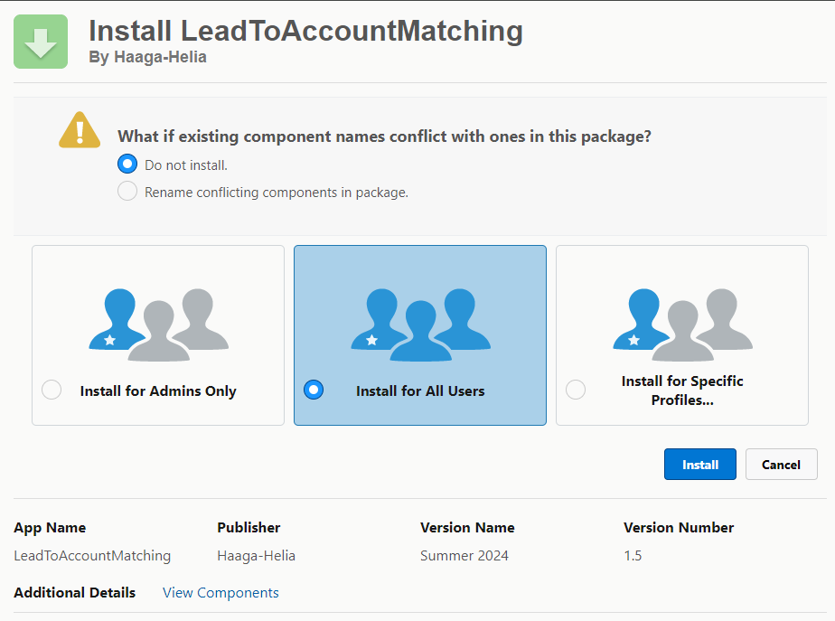
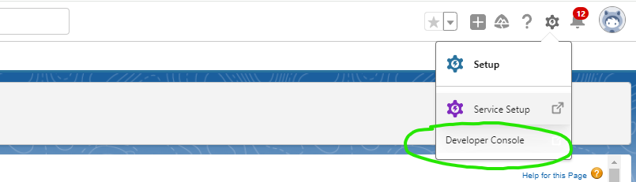
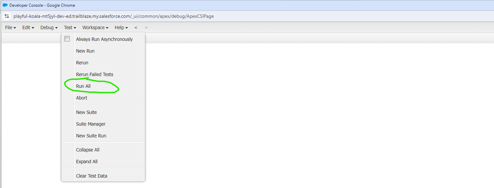
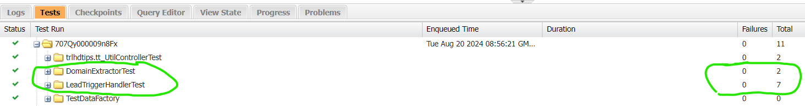

# Sections

   ## Table of Contents
   - [Solution Overview](#solution-overview)
   - [Deployment and Installation Options](#deployment-and-installation-options)
      - [Salesforce Project Deployment Guide](#salesforce-project-deployment-guide)
      - [Package Installation Guide](#leadtoaccountmatching-package-installation-guide)
   - [Testing](#testing)

# Solution Overview

## Deployment and Installation Options

This solution offers two methods of setup:

### Option 1: Direct Deployment from the Repository

- **Who should use this?** Users who want to modify the source code or deploy the solution directly from a GitHub repository.
- **What does it involve?** Using the Salesforce CLI to deploy metadata files to your Salesforce org.

### Option 2: Package Installation

- **Who should use this?** Users who prefer a quick, straightforward installation without dealing with the source code.
- **What does it involve?** Installing a pre-packaged version of the solution via a unique installation link.

### Instructions for Each Option:

- If you prefer **direct deployment**, follow the [Salesforce Project Deployment Guide](#salesforce-project-deployment-guide).
- If you prefer **package installation**, follow the [LeadToAccountMatching Package Installation Guide](#leadtoaccountmatching-package-installation-guide).

## Data Model Changes

### Fields 

1. The **Account** object was modified with an additional field:
   * **Domain** (`Domain__c`): A text field to hold the domain name extracted from the Website field.
   
2. The **Lead** object was modified with two additional fields:
   * **Account** (`Account__c`): A lookup field to the Account object.
     * Designed to create a relationship between the Account and Lead objects.

   * **isMatchedAutomatically** (`isMatchedAutomatically__c`): A number field.
     * Designed to hold values of 0 or 1, representing false or true, respectively.

### Validation Rules

1. The **Account** object was modified with a Validation rule on field Website (`Website`):
   * Validation rule checks that Website's field value begins in allowed formats:
      * https:\\\\
      * http:\\\\
      * www.


## Automations with Apex Code

### Apex Triggers

1. **AccountTrigger**: Trigger on the Account object that executes **Before Insert**.
2. **LeadTrigger**: Trigger on the Lead object that executes **Before Insert**.

### Apex Classes and Methods

#### 1. **AccountTriggerHandler**
   - **Purpose:** Handles operations triggered by the **AccountTrigger** before new accounts are inserted.
   - **Method:**
     - **setDomainFieldFromWebsite**: Loops through new accounts and populates the Domain field with the domain extracted from the Website field.

#### 2. **DomainExtractor**
   - **Purpose:** Provides methods for extracting domain information.
   - **Methods:**
     - **DomainExtractorFromAccountWebsite**: Extracts the domain part from the Account's Website field.
     - **DomainExtractorFromLeadEmail**: Extracts the domain part from the Lead's Email field.

#### 3. **LeadTriggerHandler**
   - **Purpose:** Manages operations triggered by the **LeadTrigger** before new leads are inserted.
   - **Method:**
     - **matchLeadsToAccounts**: Loops through new leads and attempts to match them with appropriate accounts.

#### 4. **MatchLeadsToAccountsHelper**
   - **Purpose:** Assists the **matchLeadsToAccounts** method in matching leads to accounts.
   - **Methods:**
     - **matchLeadsToAccountsByDomain**: Matches leads to accounts based on domain equality.
     - **directMatchLeadsToAccountsByCompanyName**: Matches leads to accounts based on exact company name equality.
     - **partialMatchLeadsToAccountsByCompanyName**: Matches leads to accounts based on partial similarity of company names.
     - **modifyLeadWithMatchedAccount**: Updates lead fields if a match with an account is found.


## Apex Test 

## Test Data

**TestDataFactory** provides methods for generating test data:

### For Leads:
- `createCustomLead()`: Creates a customized Lead.
- `createLeadWithoutEmail()`: Creates a Lead without an email.
- `createLeadWithEmail()`: Creates a Lead with an email.
- `createTenUnrelatedToAccountsLeads()`: Creates ten Leads not linked to any Accounts.

### For Accounts:
- `createCustomAccount()`: Creates a customized Account.
- `createAccountWithWebsite()`: Creates an Account with a website.
- `createFiveAccountWithoutLeads()`: Creates five Accounts without Leads.
- `createAccountsWithLeadsThatMatchButNotLinked()`: Creates Accounts and Leads with matching but unlinked data.

## Classes and Methods

#### 1. **LeadTriggerHandlerTest**
   - **Purpose:** Tests lead and account matching functionalities within the **LeadTriggerHandler**.

   **Test Methods:**

   - **leadsAndAccountsExactMatchTest**
     - **Purpose:** Verify correct matching of leads to accounts based on exact domain and company name.
     - **Setup:** Create and insert accounts and leads with matching attributes.
     - **Assertions:** Check for correct lead-account associations and unique account matches.
     - **Expected Outcome:** Leads are matched to the correct accounts; no mismatches.

   - **accountsAndLeadsWithoutAnyMatch**
     - **Purpose:** Ensure no linkage between unrelated leads and accounts.
     - **Setup:** Create unrelated accounts and leads.
     - **Assertions:** Verify that no leads are linked to any accounts.
     - **Expected Outcome:** No leads should be associated with accounts.

   - **leadsInsertWithoutAnyAccounts**
     - **Purpose:** Test lead insertion when no accounts are present.
     - **Setup:** Insert leads without pre-existing accounts.
     - **Assertions:** Confirm correct lead creation.
     - **Expected Outcome:** Leads are created successfully without errors.

   - **insertLinkedAccountsAndLeads**
     - **Purpose:** Validate that manually linked leads and accounts remain unchanged by automation.
     - **Setup:** Create and link accounts and leads manually, then insert them.
     - **Assertions:** Ensure no automatic changes to manually set links.
     - **Expected Outcome:** Manually set links remain intact.

   - **namePartialMatchingTest**
     - **Purpose:** Test partial matching of leads to accounts based on company name similarity.
     - **Setup:** Create accounts and leads with partially matching names.
     - **Assertions:** Verify correct partial name matches.
     - **Expected Outcome:** Correct leads are matched to appropriate accounts based on partial name similarities.

   - **namePartialMatchingEdgeTest**
     - **Purpose:** Test edge cases for partial name matching.
     - **Setup:** Create accounts and leads with minimal name similarity.
     - **Assertions:** Ensure no incorrect matches for edge cases.
     - **Expected Outcome:** No wrong matches should occur for minimal similarity cases.

   - **completeTriggerHandlerTest**
     - **Purpose:** Validate that Leads are correctly matched to Accounts using exact name, domain, and partial name matching.
     - **Setup:** Create accounts and leads to be match with eachother.
     - **Assertions:** Ensure evertyrhing was match and that no incorrect matches were asigned.
     - **Expected Outcome:** Leads are accurately matched to their corresponding Accounts without errors.

#### 2.DomainExtractorTest

   - **DomainExtractorFromAccountWebSiteTest**
      - **Purpose:** Verify domain extraction from account website URLs.
      - **Setup:** Insert accounts with various URL formats.
      - **Assertions:** Check if domains are correctly extracted. (company.com, comapny.com.uk, parentCompany.company.com).
      - **Expected Outcome:** Domains are in expected format.

   - **DomainExtractorFromLeadEmailTest**

      - **Purpose:** Verify domain extraction from lead email addresses.
      - **Setup:** Test with different email addresses.
      - **Assertions:** Ensure domains are correctly extracted (company.com, comapny.com.uk, parentCompany.company.com).
      - **Expected Outcome:** Domains are in expected format.


# Salesforce Project Deployment Guide

This guide will help you deploy the Salesforce project files from this repository to your own Salesforce org.

## Prerequisites

Before you begin, ensure you have the following:

- **Salesforce CLI (`sf` or `sfdx`)**: [Download and install the Salesforce CLI](https://developer.salesforce.com/tools/sfdxcli).
- **Git**: [Download and install Git](https://git-scm.com/downloads).
- **A Salesforce Developer Org or Sandbox**: Ensure you have an appropriate Salesforce org to deploy the metadata.

## Step 1: Clone the Repository

1. **Open your terminal.**
2. **Navigate to the directory** where you want to clone the repository.
3. **Run the following command** to clone the repository:

   ```bash
   git clone https://github.com/madaraDance/AivenInterviewAssignment.git
   ```

4. **Navigate into the cloned repository**:
   
   ```bash
   cd AivenInterviewAssignment
   ```

## Step 2: Authenticate to Salesforce

1. **Run the following command** to log in to your Salesforce org:
   
   1.1 **For a production or developer org**:
   ```bash
      sfdx auth:web:login --set-default --alias MyDefaultOrg
   ```
   1.2 **For a sandbox org**:

   ```bash
      sfdx auth:web:login --set-default --alias MyDefaultOrg --instanceurl https://test.salesforce.com
   ```

   2. **This command will open a browser window for you to log into Salesforce**. After logging in, the org will be set as your default org and will be associated with the alias MyDefaultOrg.


2. **Select the appropriate Salesforce environment** (Production, Sandbox, or Developer Edition) during login.

## Step 3: Deploy the Metadata to Your Org

1. **Run the following command** to deploy the metadata:
   ```bash
   sf project deploy start --source-dir force-app
   ```
2. **Wait for the deployment to complete.** The CLI will display the deployment status and any errors or warnings that occur.

## Step 4: Verify the Deployment
1. **Log in to your** Salesforce org.
2. **Navigate to Setup to check** that the custom fields, triggers, classes, and other components have been deployed successfully.
3. **Test the functionality** with instructions from **[Testing Part](#testing)** to ensure everything is working as expected.

## Step 5: Start Using the App
   1. Go to the Salesforce App Launcher and search for and open the `AivenInterview` app.
   2. Use it freely.

# LeadToAccountMatching Package Installation Guide

## Step 1: Installation

   1. To install the package, use the following URL:
      ```bash
      https://login.salesforce.com/packaging/installPackage.apexp?p0=04tQy0000002OSr
      ```
   2. Set the setting you want and click Install.
   

## Step 2: Post-Installation

1. **Navigate to the AivenInterview App**
   - After the package is installed, go to the Salesforce App Launcher.
   - Search for and open the `AivenInterview` app.

2. **Assign the New Account Record Page**
   - Go to `Setup` in Salesforce.
   - In the Quick Find box, type `Object Manager` and select `Account`.
   - Click on `Lightning Record Pages`.
   - Locate the `NewAccountRecordPage` and click on `View` or `Edit Assignment`.
   - Set this page as the **Record Page** for the `Account` object.

3. **Save the Assignment**
   - Ensure that the `NewAccountRecordPage` is now the active record page for the Account object.
   - Click `Save` to confirm the assignment.

4. **Test The Functionality**
   - Navigate to **[Testing Part](#testing)** to get testing instructions.

5. **Navigate to the AivenInterview App**
   - Now everyting is done and App is ready for use.


# Testing

To ensure the solution works correctly, follow these steps to run the provided tests:

1. **Open the Developer Console**:
   - Navigate to and open the Developer Console in your Salesforce Org.
   

2. **Run All Tests**:
   - In the Developer Console, click on **"Test"** in the upper navigation menu and select **"Run All"** from the dropdown.
   

3. **Check Test Results**:
   - After the tests have executed, go to the **"Tests"** tab in the bottom menu.
   - Open the **"First Folder"** and verify that:
     - **`DomainExtractorTest`** class has **2 tests passed**.
     - **`LeadTriggerHandlerTest`** class has **7 tests passed**.
     


